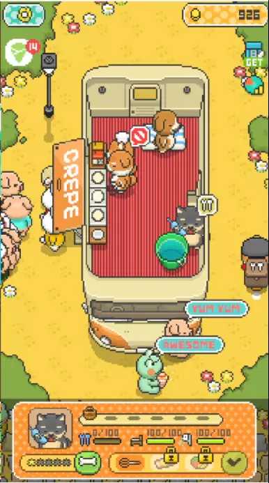
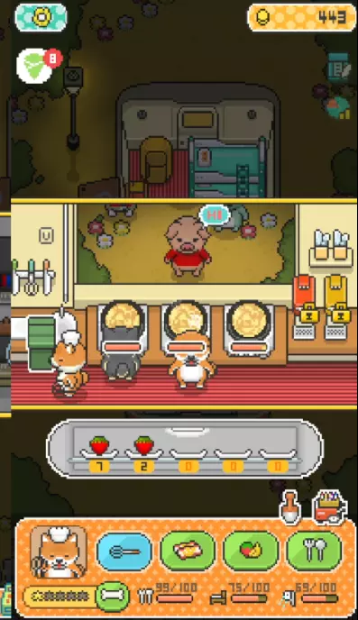

可愛的狗狗開著攤車去販售可麗餅，可愛烹飪遊戲+育成遊戲，也可以升級店鋪和服裝。  
遊戲系統屬於複雜，員工需要管理飽足度。  
另外遊戲中有兩套升級系統，升級用的骨頭蒐集需要玩另一個小遊戲，遊戲系統是相當豐富的。  
不過因為遊戲初期教學過於快速，複雜系統對於輕度玩家來說不知如何上手。  
 
 

### 行銷 - Food Truck Pup
* 平台：Mobile
    * [Google Play](https://play.google.com/store/apps/details?id=jp.gamestart.Shibainu)
    * [iOS](https://apps.apple.com/us/app/food-truck-pup-cooking-chef/id1437764328)
* 風格：像素風格 可愛擬人動物
* 遊戲核心：經營
* Google Play下載次數: 100萬+

### 優劣分析 - Food Truck Pup

* 優點
  * TA明確
  * 風格
    * 像素風
* 缺點
  * 相對於其他輕鬆遊戲偏複雜
  * 初期教學速度太快

### 系統圖 - Food Truck Pup

<iframe width="800" height="1300" src="mechanism.html"></iframe> 

