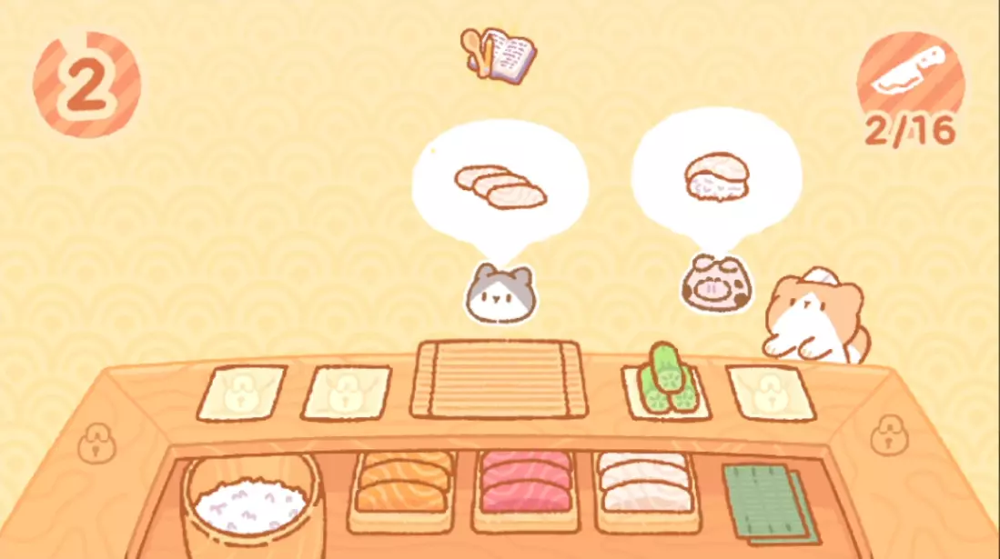
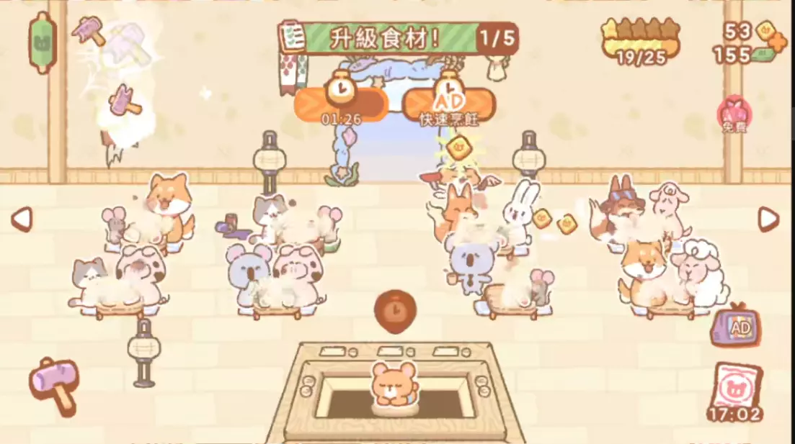

## 熊仔壽司Bar
玩家扮演可愛的熊仔接手一間破爛的店面來經營壽司店，隨著逐步翻新壽司店店面，顧客越來越多，員工也越來越多。  
遊戲系統有壽司料理，但是玩家可以跳過，但是玩壽司小遊戲Combo數會有獎勵。
遊戲一段時間內只能服務少量客戶，然後就要等待，室內裝修也是需要等待，雖然可以看廣告加速，但是項目太多。  
對於只玩2分鐘就關掉遊戲的玩家來說，是一種防沉迷機制。  
 
 

### 行銷 - 熊仔壽司Bar
* 平台：Mobile
    * [Google Play](https://play.google.com/store/apps/details?id=com.hyperbeard.kumosushibar)
    * [iOS](https://apps.apple.com/tw/app/kuma-sushi-bar/id1582196903)
* 風格：可愛擬人動物
* 遊戲核心：料理、升級店面
* Google Play下載次數: 100萬+

### 優劣分析 - 熊仔壽司Bar
* 優點
  * 有料理的環節，也可跳過
* 缺點
  * 橫向畫面在平板體驗比較好
  * 廣告過多嚴重影響遊戲體驗

### 系統圖 - 熊仔壽司Bar

<iframe class="my-iframe" width="800" height="1300" src="mechanism.html"></iframe> 

